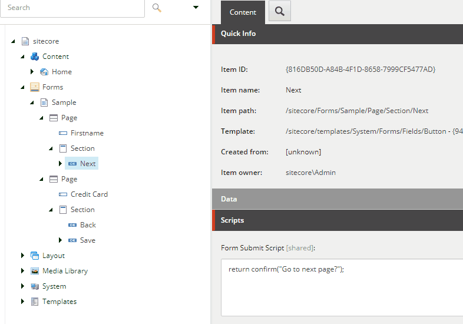

# Sc.FormsCustomScripts

Add ability to define custom javascript code which is executed on Sitecore Forms submit.

## Manual Installation/Install from Source

* Clone repository
* If needed update nuget packages used in Sc.FormsCustomSCripts project to match your Sitecore 9 version
* Update `publishUrl` to your Sitecore instance URL in `publishsettings.targets` file
* Update path in `SourceFolderScUpdateContact` variable to your local repository folder in `Sc.FormsCustomSCripts.DevSettings.config` file
* (Optionally) publish `Serialization` project from Visual Studio. This project contains Unicorn assemblies and configuration. If you already have Unicorn in your solution you can skip this step.
* Publish `Sc.FormsCustomSCripts` project.   
* Go to {your-sitecore-instance}/unicorn.aspx and sync `Foundation.Sc.FormsCustomScripts` project.

<aside class="notice">
Warning: installation overwrites Sitecore platform items:  
`/sitecore/templates/System/Forms/Fields/Button`  
`/sitecore/system/Settings/Forms/Field Types/Structure/Submit Button`  

and Sitecore platform file:  
\Views\FormBuilder\FieldTemplates\Button.cshtml
</aside>
